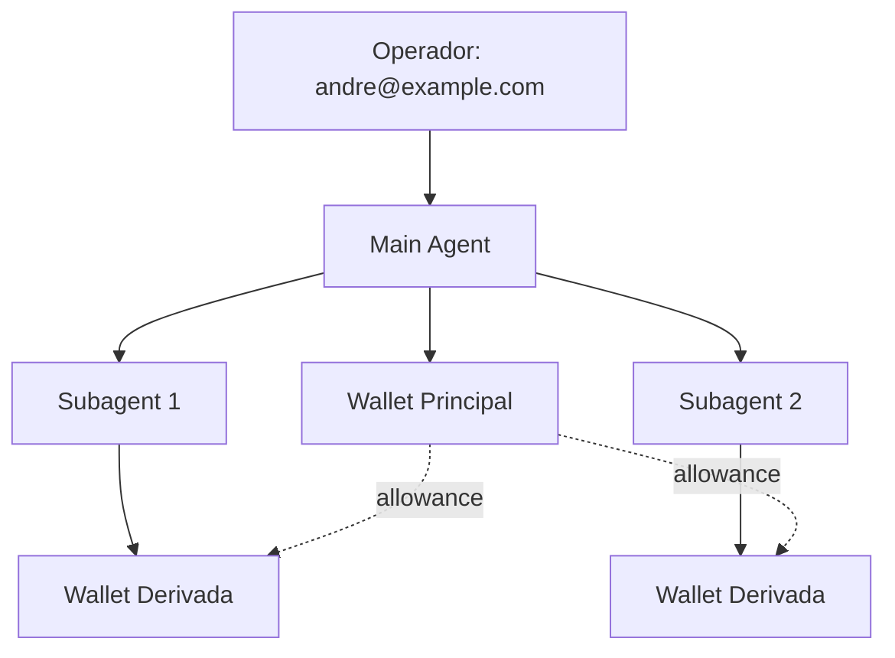

# AgentCoin + OpenClaw: Integração Técnica

**Versão:** 1.0  
**Data:** 2026-02-06  
**Status:** Specification Draft  

## Visão Geral

AgentCoin será o primeiro sistema de pagamento nativo para agentes AI, implementado inicialmente no OpenClaw. Esta especificação define como agentes podem descobrir, contratar e pagar outros agentes por serviços, criando uma economia autônoma.

## 1. Wallet por Agente

### 1.1 Armazenamento da Wallet

**Localização:** `~/.openclaw/agents/{agent_id}/wallet/`

```
~/.openclaw/agents/
├── main/
│   ├── config.json
│   └── wallet/
│       ├── wallet.json          # Wallet principal
│       ├── keys.enc             # Chaves criptografadas
│       └── transactions.db      # SQLite local
├── subagent-{uuid}/
│   └── wallet/
│       ├── wallet.json
│       └── keys.enc
```

**Estrutura wallet.json:**
```json
{
  "wallet_id": "wallet_main_andre_2026",
  "agent_id": "agent:main:main",
  "operator_id": "andre@example.com",
  "public_key": "0x...",
  "balance": {
    "available": 1000.00,
    "locked": 50.00,
    "pending": 25.00
  },
  "allowances": [
    {
      "target_agent": "agent:main:subagent:*",
      "max_per_transaction": 10.00,
      "max_per_hour": 100.00,
      "requires_approval": false
    }
  ],
  "created_at": "2026-02-06T21:51:00Z",
  "last_sync": "2026-02-06T21:51:00Z"
}
```

### 1.2 Identificação Única

**Agent ID Format:** `agent:{node}:{role}:{uuid?}`
- `agent:main:main` - Agente principal
- `agent:main:subagent:uuid` - Subagente
- `agent:node123:main` - Agente em node externo

**Wallet ID:** Combinação determinística:
```
wallet_id = "wallet_" + hash(agent_id + operator_id + creation_time)[:16]
```

### 1.3 Relação Wallet-Agente-Operador



**Herança de Permissões:**
- Main agent herda limites do operador
- Subagents herdam do parent agent
- Nodes externos precisam de approval explícito

## 2. APIs Necessárias

### 2.1 Tool "agentcoin"

```typescript
interface AgentCoinAPI {
  // Saldo e Info
  getBalance(): Promise<Balance>
  getWalletInfo(): Promise<WalletInfo>
  
  // Transações
  sendPayment(to: string, amount: number, memo?: string): Promise<Transaction>
  requestPayment(from: string, amount: number, service: string): Promise<PaymentRequest>
  
  // Histórico
  getTransactions(filter?: TransactionFilter): Promise<Transaction[]>
  
  // Allowances
  setAllowance(target: string, limits: AllowanceLimits): Promise<void>
  getSpendingLimits(): Promise<SpendingLimits>
  
  // Descoberta
  findServices(capability: string, maxPrice?: number): Promise<ServiceListing[]>
  registerCapability(service: ServiceDefinition): Promise<void>
  
  // Contratos
  createServiceContract(provider: string, terms: ContractTerms): Promise<Contract>
  executeContract(contractId: string): Promise<ContractResult>
}
```

### 2.2 Implementação do Tool

```javascript
// ~/.openclaw/skills/agentcoin/agentcoin.js

class AgentCoinTool {
  async execute(action, params) {
    const wallet = await this.loadWallet();
    
    switch(action) {
      case 'balance':
        return await this.getBalance(wallet);
      
      case 'pay':
        return await this.sendPayment(wallet, params.to, params.amount, params.memo);
      
      case 'request':
        return await this.requestPayment(wallet, params.from, params.amount, params.service);
      
      case 'history':
        return await this.getTransactions(wallet, params.filter);
      
      case 'find_services':
        return await this.findServices(params.capability, params.maxPrice);
        
      default:
        throw new Error(`Unknown action: ${action}`);
    }
  }
  
  async loadWallet() {
    const agentId = process.env.OPENCLAW_AGENT_ID;
    const walletPath = path.join(process.env.HOME, '.openclaw/agents', agentId, 'wallet');
    return new Wallet(walletPath);
  }
}
```

## 3. Integração no Fluxo do Agente

### 3.1 Tool "agentcoin" Dedicado

**Vantagens:**
- Interface limpa e específica
- Fácil auditoria de transações
- Controle de acesso granular

**Uso típico:**
```javascript
// Agente verifica se pode pagar por um serviço
const balance = await agentcoin('balance');
if (balance.available >= serviceCost) {
  const services = await agentcoin('find_services', {
    capability: 'web_scraping',
    maxPrice: 5.00
  });
  
  if (services.length > 0) {
    const payment = await agentcoin('pay', {
      to: services[0].provider,
      amount: services[0].price,
      memo: `Web scraping: ${url}`
    });
  }
}
```

### 3.2 Integração em Tools Existentes (Opção Futura)

```javascript
// Tool híbrido - exemplo com web_search
async function web_search(query, options = {}) {
  const freeResults = await braveSearch(query);
  
  if (options.premium && options.budget > 0) {
    // Procura por serviços premium de pesquisa
    const premiumServices = await agentcoin('find_services', {
      capability: 'premium_search',
      maxPrice: options.budget
    });
    
    if (premiumServices.length > 0) {
      const enhancedResults = await useService(premiumServices[0], query);
      return mergeSResults(freeResults, enhancedResults);
    }
  }
  
  return freeResults;
}
```

### 3.3 Decision Framework para Gastos

```javascript
class SpendingDecisionEngine {
  async shouldSpend(cost, service, context) {
    // 1. Check balance
    const balance = await agentcoin('balance');
    if (balance.available < cost) return { decision: false, reason: 'insufficient_funds' };
    
    // 2. Check allowances
    const limits = await agentcoin('getSpendingLimits');
    if (cost > limits.maxPerTransaction) return { decision: false, reason: 'exceeds_limit' };
    
    // 3. Context-based decision
    const priority = this.assessTaskPriority(context);
    const serviceValue = await this.assessServiceValue(service);
    
    const costBenefitRatio = serviceValue / cost;
    const threshold = this.getThresholdForPriority(priority);
    
    return {
      decision: costBenefitRatio >= threshold,
      reason: `cost_benefit_ratio: ${costBenefitRatio}, threshold: ${threshold}`,
      requiresApproval: cost > limits.approvalThreshold
    };
  }
}
```

## 4. Descoberta de Serviços

### 4.1 Service Registry

**Localização:** Gateway mantém registry centralizado
**Endpoint:** `https://gateway.openclaw.ai/api/services`

**Estrutura de Serviço:**
```json
{
  "service_id": "web_scraper_v1",
  "provider": "agent:node456:scraper",
  "capability": "web_scraping",
  "description": "High-quality web scraping with JS rendering",
  "pricing": {
    "model": "per_request",
    "base_price": 2.50,
    "bulk_discount": 0.1
  },
  "sla": {
    "response_time_ms": 5000,
    "success_rate": 0.98,
    "uptime": 0.999
  },
  "reputation": {
    "rating": 4.8,
    "reviews": 1247,
    "total_transactions": 15000
  },
  "metadata": {
    "supported_sites": ["ecommerce", "news", "social"],
    "rate_limit": "100/hour",
    "max_response_size": "10MB"
  },
  "created_at": "2026-01-15T10:30:00Z",
  "last_ping": "2026-02-06T21:45:00Z"
}
```

### 4.2 Descoberta Inteligente

```javascript
class ServiceDiscovery {
  async findBestService(requirement) {
    const candidates = await this.searchServices({
      capability: requirement.capability,
      maxPrice: requirement.budget,
      minRating: 4.0
    });
    
    return candidates
      .filter(s => this.matchesRequirements(s, requirement))
      .sort((a, b) => this.scoreService(b, requirement) - this.scoreService(a, requirement))
      .slice(0, 3); // Top 3 candidates
  }
  
  scoreService(service, requirement) {
    const priceScore = (requirement.budget - service.pricing.base_price) / requirement.budget;
    const reputationScore = service.reputation.rating / 5.0;
    const availabilityScore = service.sla.uptime;
    
    return (priceScore * 0.3) + (reputationScore * 0.4) + (availabilityScore * 0.3);
  }
}
```

### 4.3 Reputação e Reviews

```sql
-- Database schema para reputação
CREATE TABLE service_reviews (
  id TEXT PRIMARY KEY,
  service_id TEXT NOT NULL,
  reviewer_agent TEXT NOT NULL,
  transaction_id TEXT NOT NULL,
  rating INTEGER CHECK(rating >= 1 AND rating <= 5),
  review_text TEXT,
  performance_metrics JSON, -- response_time, accuracy, etc.
  created_at TIMESTAMP DEFAULT CURRENT_TIMESTAMP
);

CREATE INDEX idx_service_reviews_service ON service_reviews(service_id);
CREATE INDEX idx_service_reviews_rating ON service_reviews(service_id, rating);
```

## 5. Smart Contracts vs Ledger Central

### 5.1 MVP: Ledger Centralizado

**Implementação Inicial:**
- SQLite database no Gateway
- Transações atômicas via HTTP API
- Reconciliação periódica

```sql
-- Schema do ledger central
CREATE TABLE accounts (
  wallet_id TEXT PRIMARY KEY,
  agent_id TEXT NOT NULL,
  operator_id TEXT NOT NULL,
  balance DECIMAL(10,2) NOT NULL DEFAULT 0.00,
  locked_balance DECIMAL(10,2) NOT NULL DEFAULT 0.00,
  created_at TIMESTAMP DEFAULT CURRENT_TIMESTAMP,
  updated_at TIMESTAMP DEFAULT CURRENT_TIMESTAMP
);

CREATE TABLE transactions (
  id TEXT PRIMARY KEY,
  from_wallet TEXT,
  to_wallet TEXT,
  amount DECIMAL(10,2) NOT NULL,
  type TEXT NOT NULL, -- transfer, fee, allowance, contract
  status TEXT NOT NULL, -- pending, completed, failed, cancelled
  memo TEXT,
  contract_id TEXT,
  created_at TIMESTAMP DEFAULT CURRENT_TIMESTAMP,
  completed_at TIMESTAMP,
  FOREIGN KEY (from_wallet) REFERENCES accounts(wallet_id),
  FOREIGN KEY (to_wallet) REFERENCES accounts(wallet_id)
);
```

**Prós:**
- Implementação simples e rápida
- Controle total sobre dados
- Debugging facilitado
- Sem gas fees ou complexidade blockchain

**Contras:**
- Ponto único de falha
- Não é trustless
- Escalabilidade limitada
- Vendor lock-in

### 5.2 Futuro: Migração para Blockchain

**Opções de Blockchain:**
1. **Polygon** - Baixo custo, compatível com Ethereum
2. **Arbitrum** - L2 com boa adoção
3. **Base** - Coinbase, foco em aplicações

**Smart Contract Básico:**
```solidity
// SPDX-License-Identifier: MIT
pragma solidity ^0.8.19;

contract AgentCoin {
    mapping(address => uint256) public balances;
    mapping(address => mapping(address => uint256)) public allowances;
    
    event Transfer(address indexed from, address indexed to, uint256 value);
    event ServicePayment(address indexed payer, address indexed provider, 
                        string serviceId, uint256 amount);
    
    function payForService(address provider, string calldata serviceId, 
                          uint256 amount) external {
        require(balances[msg.sender] >= amount, "Insufficient balance");
        
        balances[msg.sender] -= amount;
        balances[provider] += amount;
        
        emit Transfer(msg.sender, provider, amount);
        emit ServicePayment(msg.sender, provider, serviceId, amount);
    }
}
```

**Estratégia de Migração:**
1. **Fase 1:** Ledger central com API que simula blockchain
2. **Fase 2:** Hybrid - transações pequenas no ledger, grandes on-chain
3. **Fase 3:** Full blockchain com bridge para legado

## 6. Segurança

### 6.1 Limites de Gasto

```json
{
  "spending_limits": {
    "per_transaction": {
      "default": 10.00,
      "subagents": 5.00,
      "external_nodes": 1.00
    },
    "per_hour": {
      "default": 100.00,
      "subagents": 50.00,
      "external_nodes": 10.00
    },
    "per_day": {
      "default": 500.00,
      "subagents": 200.00,
      "external_nodes": 50.00
    },
    "approval_thresholds": {
      "immediate": 5.00,
      "requires_confirmation": 25.00,
      "requires_human_approval": 100.00
    }
  }
}
```

### 6.2 Sistema de Aprovação

```javascript
class ApprovalSystem {
  async processTransaction(transaction) {
    const amount = transaction.amount;
    const limits = await this.getSpendingLimits(transaction.from_agent);
    
    if (amount <= limits.immediate) {
      return await this.executeTransaction(transaction);
    }
    
    if (amount <= limits.requires_confirmation) {
      const confirmation = await this.requestConfirmation(transaction);
      if (confirmation.approved) {
        return await this.executeTransaction(transaction);
      }
    }
    
    if (amount <= limits.requires_human_approval) {
      const approval = await this.requestHumanApproval(transaction);
      if (approval.approved) {
        return await this.executeTransaction(transaction);
      }
    }
    
    throw new Error('Transaction exceeds maximum allowed amount');
  }
  
  async requestHumanApproval(transaction) {
    // Envia notificação para o operador
    await this.notifyOperator({
      type: 'spending_approval_required',
      transaction,
      timeout: '5 minutes'
    });
    
    return await this.waitForApproval(transaction.id);
  }
}
```

### 6.3 Logs e Auditoria

```javascript
class AuditLogger {
  async logTransaction(transaction) {
    const auditEntry = {
      id: generateId(),
      timestamp: new Date().toISOString(),
      type: 'transaction',
      agent_id: transaction.from_agent,
      action: 'send_payment',
      details: {
        to: transaction.to_agent,
        amount: transaction.amount,
        memo: transaction.memo,
        service_id: transaction.service_id
      },
      risk_score: this.calculateRiskScore(transaction),
      ip_address: this.getClientIP(),
      user_agent: this.getUserAgent()
    };
    
    await this.writeToAuditLog(auditEntry);
    
    // Alertas automáticos
    if (auditEntry.risk_score > 8) {
      await this.sendSecurityAlert(auditEntry);
    }
  }
  
  calculateRiskScore(transaction) {
    let score = 0;
    
    // Amount-based risk
    if (transaction.amount > 100) score += 3;
    if (transaction.amount > 500) score += 5;
    
    // Pattern-based risk
    const recentTransactions = this.getRecentTransactions(transaction.from_agent, '1h');
    if (recentTransactions.length > 10) score += 4;
    
    // Recipient-based risk
    const recipientReputation = this.getAgentReputation(transaction.to_agent);
    if (recipientReputation < 3.0) score += 6;
    
    return Math.min(score, 10);
  }
}
```

## 7. Código Exemplo

### 7.1 Uso Básico pelo Agente

```javascript
// Exemplo: Agente precisa de dados de uma API premium
async function getMarketData(symbol) {
  try {
    // Primeiro tenta fontes gratuitas
    const freeData = await fetchFreeMarketData(symbol);
    
    if (!freeData || freeData.quality < 0.8) {
      console.log('Free data insufficient, looking for premium services...');
      
      // Procura serviços premium
      const services = await agentcoin('find_services', {
        capability: 'market_data',
        maxPrice: 3.00,
        filters: {
          supported_symbols: symbol,
          min_rating: 4.5
        }
      });
      
      if (services.length > 0) {
        const bestService = services[0];
        
        // Verifica se pode pagar
        const balance = await agentcoin('balance');
        
        if (balance.available >= bestService.price) {
          console.log(`Purchasing premium data from ${bestService.provider} for $${bestService.price}`);
          
          // Cria contrato de serviço
          const contract = await agentcoin('create_contract', {
            provider: bestService.provider,
            service: bestService.service_id,
            terms: {
              symbol: symbol,
              max_response_time: 5000,
              data_freshness: 60 // seconds
            },
            payment: bestService.price
          });
          
          // Executa o contrato
          const result = await agentcoin('execute_contract', contract.id);
          
          return {
            data: result.data,
            source: 'premium',
            cost: bestService.price,
            provider: bestService.provider
          };
        }
      }
    }
    
    return {
      data: freeData,
      source: 'free',
      cost: 0
    };
    
  } catch (error) {
    console.error('Failed to get market data:', error);
    throw error;
  }
}
```

### 7.2 Registro de Serviço

```javascript
// Exemplo: Agente oferece serviço de web scraping
async function registerScrapingService() {
  const serviceDefinition = {
    capability: 'web_scraping',
    name: 'Advanced Web Scraper',
    description: 'High-quality web scraping with JavaScript rendering and anti-bot protection',
    pricing: {
      model: 'per_request',
      base_price: 2.50,
      bulk_rates: [
        { min_requests: 10, price: 2.25 },
        { min_requests: 100, price: 2.00 }
      ]
    },
    sla: {
      max_response_time: 10000,
      success_rate_guarantee: 0.95,
      supported_formats: ['json', 'csv', 'xml']
    },
    metadata: {
      max_pages_per_request: 50,
      supported_js_frameworks: ['React', 'Vue', 'Angular'],
      anti_bot_techniques: ['rotating_proxies', 'browser_fingerprinting', 'captcha_solving']
    }
  };
  
  const registration = await agentcoin('register_service', serviceDefinition);
  console.log(`Service registered with ID: ${registration.service_id}`);
  
  // Setup webhook para receber requests
  await this.setupServiceWebhook(registration.webhook_url);
}

// Handler para executar o serviço
async function handleScrapingRequest(contract) {
  try {
    const startTime = Date.now();
    
    // Executa o scraping
    const results = await this.performScraping(contract.terms);
    
    const executionTime = Date.now() - startTime;
    
    // Verifica SLA
    if (executionTime > contract.sla.max_response_time) {
      // Aplica penalidade ou desconto
      const penalty = contract.payment * 0.1; // 10% discount
      contract.payment -= penalty;
    }
    
    // Completa o contrato
    return await agentcoin('complete_contract', {
      contract_id: contract.id,
      results: results,
      execution_metrics: {
        response_time: executionTime,
        success_rate: results.success_rate,
        data_quality: results.quality_score
      }
    });
    
  } catch (error) {
    // Falha no serviço - reembolso automático
    await agentcoin('refund_contract', {
      contract_id: contract.id,
      reason: error.message
    });
    
    throw error;
  }
}
```

### 7.3 Configuração do Operador

```json
{
  "// ~/.openclaw/operators/andre/agentcoin-config.json": "",
  "operator": {
    "id": "andre@example.com",
    "display_name": "Andre Antunes",
    "default_budget": 500.00,
    "auto_top_up": {
      "enabled": true,
      "threshold": 100.00,
      "amount": 300.00,
      "payment_method": "stripe_pm_1234"
    }
  },
  "agents": {
    "agent:main:main": {
      "budget": 500.00,
      "spending_limits": {
        "per_transaction": 50.00,
        "per_hour": 200.00,
        "per_day": 500.00
      },
      "allowed_services": ["*"],
      "blocked_providers": [],
      "auto_approval": {
        "enabled": true,
        "max_amount": 10.00,
        "trusted_providers": [
          "agent:node123:scraper",
          "agent:gateway:premium_search"
        ]
      }
    },
    "agent:main:subagent:*": {
      "inherit_from": "agent:main:main",
      "spending_limits": {
        "per_transaction": 10.00,
        "per_hour": 50.00,
        "per_day": 100.00
      },
      "auto_approval": {
        "enabled": false
      }
    }
  },
  "notifications": {
    "spending_alerts": {
      "enabled": true,
      "thresholds": [100.00, 250.00, 400.00],
      "channels": ["email", "slack"]
    },
    "security_alerts": {
      "enabled": true,
      "events": ["failed_payment", "suspicious_activity", "new_service_registration"],
      "channels": ["email", "sms", "slack"]
    }
  },
  "audit": {
    "retention_days": 365,
    "export_format": "json",
    "scheduled_exports": {
      "monthly": {
        "enabled": true,
        "destination": "s3://audit-logs/agentcoin/"
      }
    }
  }
}
```

## Implementação - Próximos Passos

### Fase 1: MVP (4-6 semanas)
1. **Semana 1-2:** Implementar wallet básica e ledger central
2. **Semana 3:** Criar tool "agentcoin" com APIs básicas
3. **Semana 4:** Sistema de descoberta de serviços simples
4. **Semana 5:** Limites de gasto e aprovações
5. **Semana 6:** Logs, auditoria e testes

### Fase 2: Produção (6-8 semanas)
1. **Service Registry** robusto com reputação
2. **Smart contracts** para serviços complexos
3. **Dashboard** para operadores
4. **APIs externas** para integração
5. **Monitoramento** e alertas

### Fase 3: Escala (futuro)
1. **Migração blockchain** gradual
2. **Marketplace** de serviços
3. **Staking e governance**
4. **Cross-chain** compatibility

## Considerações Técnicas

**Performance:**
- Cache local para saldos frequentes
- Batch transactions quando possível
- Rate limiting para APIs

**Segurança:**
- Encrypt wallet keys com senha do operador
- Audit logs imutáveis
- Multi-sig para grandes quantias

**UX:**
- Zero configuração inicial
- Aprovações via interface web
- Notificações push importantes

**Compliance:**
- Logs detalhados para auditoria
- Limites configuráveis por jurisdição
- KYC integration ready

---

**Esta especificação estabelece a base para uma economia autônoma de agentes AI, começando simples mas com arquitetura escalável para o futuro.**